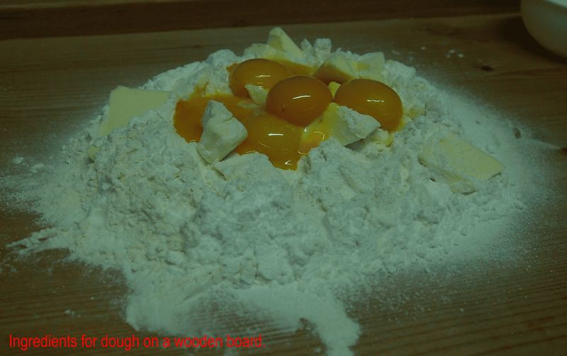
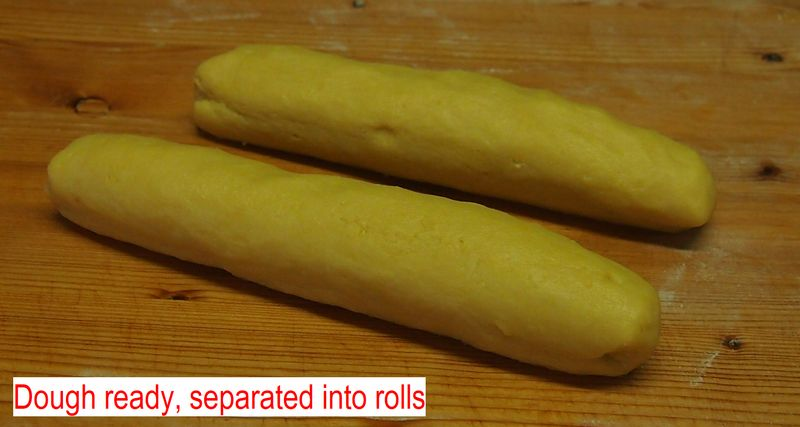
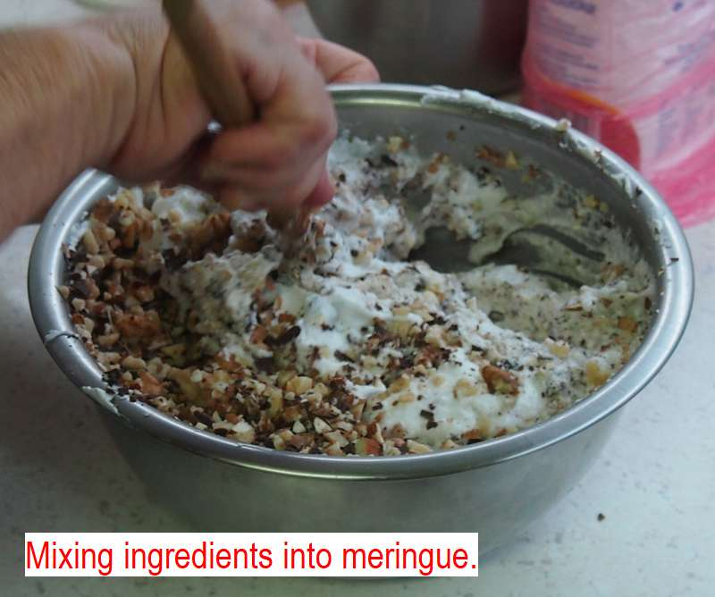
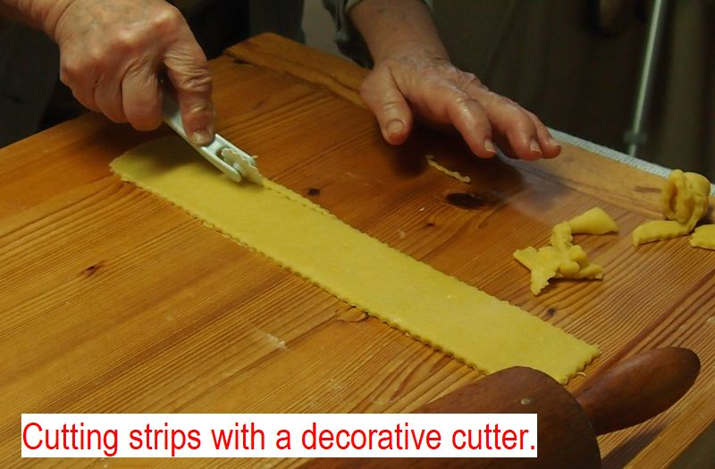
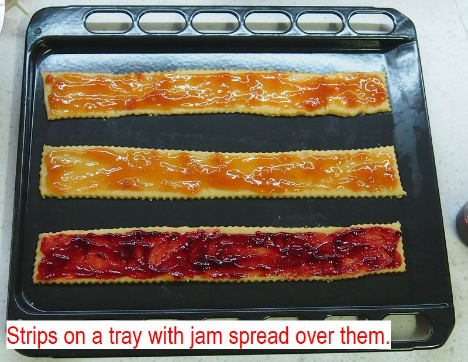
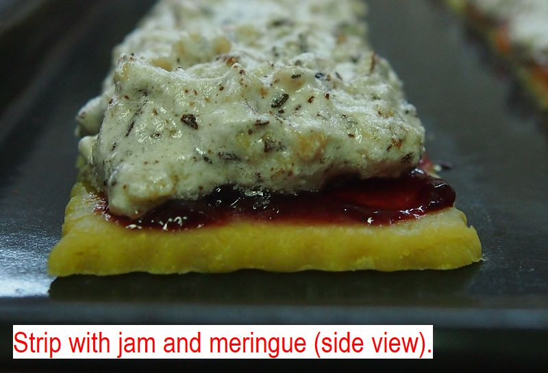
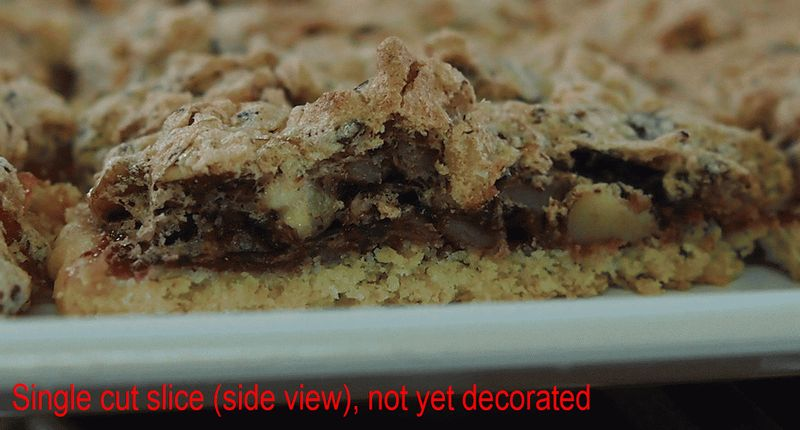
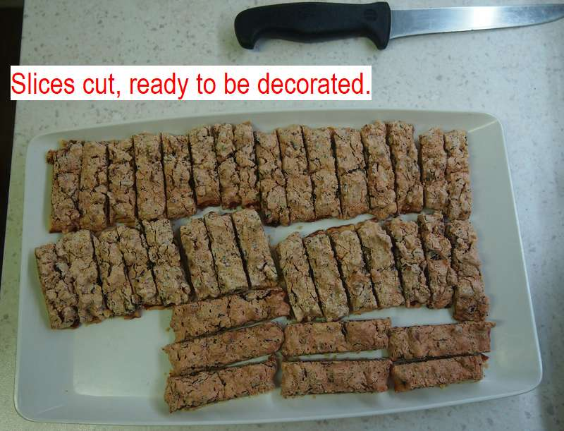

Hamburg slices
==============
> - 360 g of wheat flour (finely milled, dry, T650 using Czech notation - see attached article)
> - 160 g of butter (82%)
> - 6 egg yolks (yellow part of egg)
> - half a tablespoon of sodium bicarbonate (chemical formula NaHCO3)

Mix the flower, butter, egg, sugar, and sodium bicarbonate to make the dough for the base. Sifting the dry components through a strainer (plastic or metal mesh) will prevent clumps from forming.
`TIP: make a volcano shape out of the flower and sugar, pour the eggs into the crater and add butter. Take a longer blunt knife and "chop" the butter and eggs into the flower for the initial mixing. Then you can grab the mix with hands and squish it together until even. SEE IMAGE _Ingredients for dough_`

Separate the dough into two or three parts and hand roll them into thick rolls for better cooling through. Cover them with a piece of plastic or paper napkin and allow them to cool down in a cold environment (around 10°C). SEE IMAGE 

## For meringue
> - 6 egg whites
> - 100 g casting (crystal) sugar
> - a pinch of salt

Meringue is a mixture of chicken egg whites, dissolved sugar crystals and air. The air bubbles are within the egg whites and form a mixture which we call foam. 

`What is a hot water bath? To make a hot water bath, you take a larger pot, fill it with water and heat it. Then, you take a smaller pot or a bowl, and you place it so that it is in contact with the water by as most of it's surface. It is important that the water can not flow inside the bowl.
Boiling water has a temperature of about 100°C all throughout, which makes it easy to heat the smaller bowl easily as well as prevent it from getting too hot. Without the water bath, the eggs and sugar tend to overheat and burn.`

Pour the egg whites into a hot water bath, add the pinch of salt and start mixing the eggs using an electrical mixer whilst heating the water. Once the egg whites start foaming up, add the sugar and continue mixing. The meringue is ready once a wooden spoon dipped into it will remain standing upright. It is important that this is done in the heated hot water bath, as the heat treatment will make the meringue firmer and will prevent it from collapsing later.
Once the meringue is sufficiently firm, we take it off the hot water bath and let it cool in a cool place or the refrigerator (around 10 degrees celsius). Whilst the meringue cools, we can gently mix it one or two times so that it cools quicker and more evenly.

## To mix into meringue
> - 150 g of almonds, chopped into mid-sized bits
> - 150 g walnuts, chopped into mid-sized bits
> 80 - 100 g of chocolate, chopped into mid-sized bits (around 60% of cocoa solids, but most importantly it has to be crunchy)
> - half a teaspoon of ground cinnamon 

Gently mix the chopped walnuts, almonds, chocolate and cinnamon into the now-cold meringue. SEE IMAGE _mixing meringue_. 

It is important that you mix gently, otherwise you risk releasing too much bubbles from the meringue. Do not add the chocolate into the meringue while it is hot, or the chocolate will melt, which we want to avoid.

## Adding it all together
> - jam, also known as fruit preserve (apricot, strawberry are best, other is fine too - it should be somewhat sour)

Take out the cooled dough that you separated into rolls earlier. Cut about a third of each one and roll it into a rectangular base about 3 to 4 mm (milimeters) thick and about 80 to 100 mm (milimeters) wide. SEE IMAGE _cutting strips_.

They should be as long as necessary to fit into your oven. Spread a rather thin layer of jam over the slice, leaving roughly 4 mm thick area around the edges uncovered. This will make the slices look nicer and prevent the jam from dripping off the base. SEE IMAGE _strips on tray with jam_.

Using a spoon, spread the meringue (with nuts, chocolate and cinnamon already mixed in) over the jam. The meringue layer should be 4x to 6x times thicker then the base, or, if the base is according to the recipe, about 15 to 20 mm thick. SEE IMAGE _strips with jam and meringue_.

## Baking
To bake, place the covered bases onto a tray and bake in an oven.  Preheat the oven to 200°C, then after a short while, reduce the temperature to 170°C. If it seems to be baking to fast, you can also reduce to 150°C. The goal of the baking is to make the meringue slightly crispy on top, firm but chewy in the middle, and the base well done so as to remove the taste of raw flower. SEE IMAGE _single cut slice, not yet decorated_

If the meringue is being cooked much faster then the base, you can cover the top of the slices with either aluminium foil or a paper napkin, lower the heat to 150°C and keep baking. Once sufficiently done, take the tray out of the oven and place it on a cold surface in order to quickly stop the baking process.
Wait for the slices to cool to room temperature (around 25°C, but precision is not crucial), and cut them into slices about 20 mm (milimetres) wide. SEE IMAGE _slices cut, ready to be decorated_

## Decorating
> - butter
> - mix of dark and semi-dark (type used for cooking) chocolate (70% and 50% of cocoa solids respectively, different brands are preferable)

Align the 2 mm slices next to each other on a large tray. SEE IMAGE _slices cut, ready to be decorated_

Melt the butter and chocolate in a cup in a hot water bath (same style as described in the meringue section). The exact ratio of butter and chocolate will depend on your type of chocolate and butter. Once melted, it should be liquid enough to allow smooth flow, but thick enough so it can solidify after cooling down. Once the mixture is liquid enough, take a spoon and pour thin strands of chocolate over the whole tray. This can be done by repeatedly dipping the spoon into the mixture and flicking it left and right over the tray.

